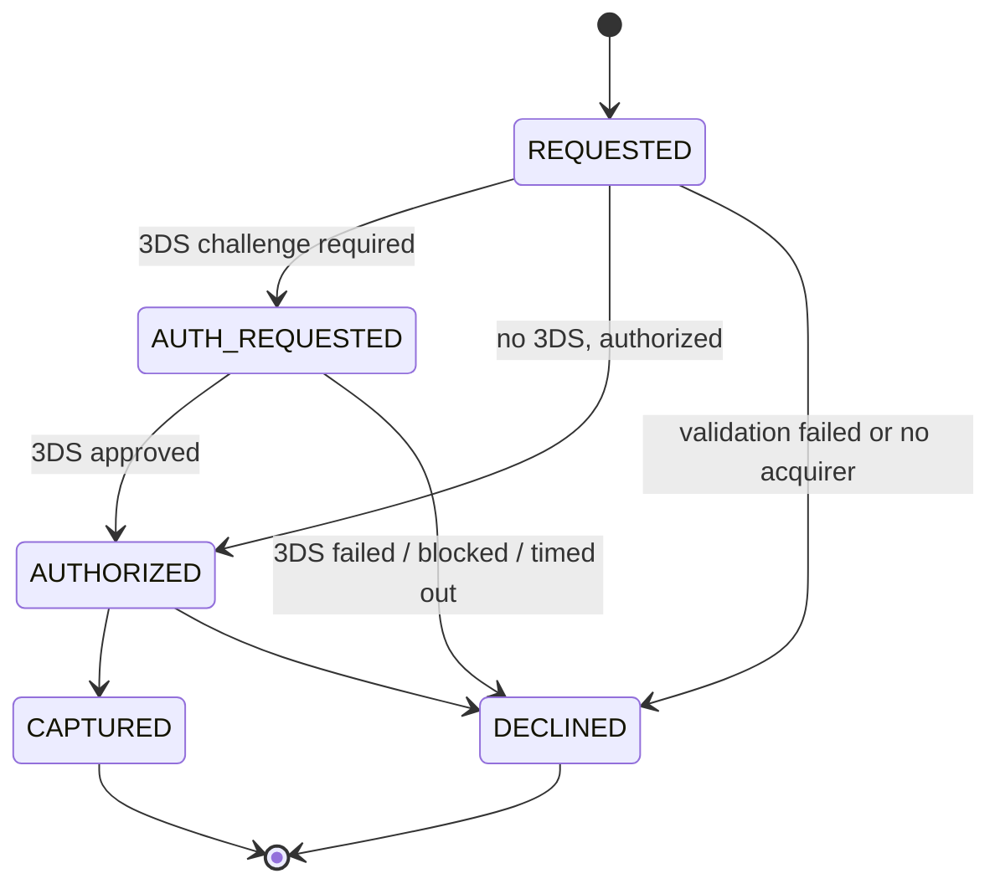
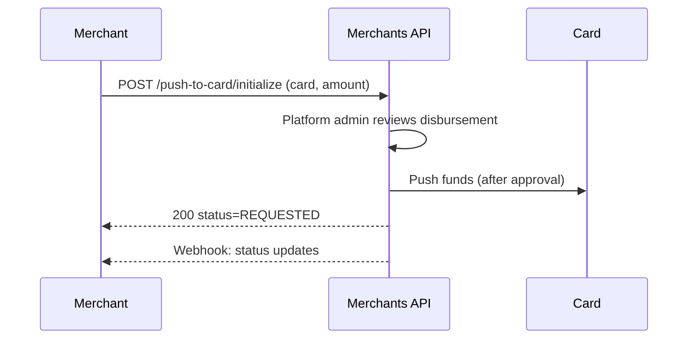
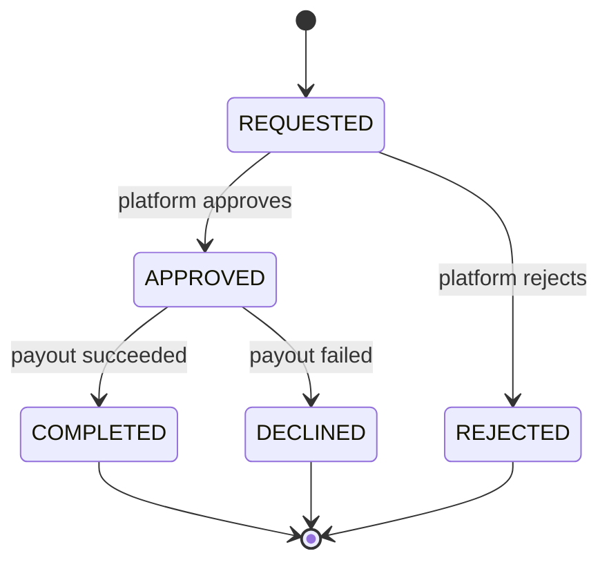

# Card Payments

> **Removed endpoints (2026-09):** the direct card endpoints — `POST /payment`, `POST /payment/batch`, `POST /payment/crypto` (first generation), `POST /payment/google-pay`, `POST /payment/apple-pay`, and `POST /payment/{id}/refund` — have been **removed** and now return `404`. Card payments are accepted exclusively through the hosted payments page via the [initialize flow](crypto-payments.md) (`POST /payment/crypto/initialize` / [`POST /payment/fiat/initialize`](fiat-payments.md)); disbursements use [`POST /push-to-card/initialize`](#push-to-card).

This page covers the card-side mechanics shared by every payment: the card attempt lifecycle, 3D Secure handling, push-to-card disbursements, and the sandbox test cards.

## Card Whitelisting Prerequisite

Depending on your merchant account configuration, cards may need to be [whitelisted](blocklist-and-whitelist.md#card-whitelist) before they can be used for payments. If your account has card whitelisting enabled, you must register each card via the whitelist API and wait for the ~72-hour cooldown period to expire before processing a payment. Payments attempted with non-whitelisted or cooldown-active cards will be declined.

## Card Attempt Lifecycle

When a customer pays by card on the hosted payments page, the card charge is recorded as an **attempt** inside the payment — visible in the `attempts` array of [`GET /payment/{id}`](crypto-payments.md#payment-records-and-attempts). The payment itself moves through the top-level [payment lifecycle](crypto-payments.md#payment-lifecycle) (`INITIALIZED → PENDING → COMPLETED / DECLINED`); each card attempt has its own sub-lifecycle:



| Status           | Description                                                                  |
|------------------|------------------------------------------------------------------------------|
| `REQUESTED`      | Card attempt created and being processed                                     |
| `AUTH_REQUESTED` | Customer must complete a 3DS challenge (set only when 3D Secure is required) |
| `AUTHORIZED`     | Card authorized, funds reserved                                              |
| `CAPTURED`       | Funds captured from the card (terminal, success)                             |
| `DECLINED`       | Attempt declined by the issuer or platform (terminal). For 3DS-specific declines, inspect `responseCode` (see [3DS failure outcomes](#id-3ds-failure-outcomes)). |

A captured attempt completes the payment (`status: COMPLETED`); a declined attempt can be followed by another attempt while the hosted-page session is still valid. The [`PAYMENT` webhook](webhooks.md) reports the **payment-level** outcome (`COMPLETED` or `DECLINED`), not the individual attempt transitions — poll `GET /payment/{id}` if you need attempt-level detail.

## 3D Secure (3DS)

3DS is handled entirely on the hosted payments page: when the issuer requires a challenge, the page takes the customer through it and back, then continues the flow. You never deliver a 3DS URL yourself, and no webhook is sent for the challenge step.

### 3DS failure outcomes

There is no dedicated status for 3DS failure or 3DS expiry. When a 3DS challenge does not succeed, the card attempt (and with it the payment) transitions to `DECLINED`, and the `responseCode` field carries the specific reason. Two `responseCode` values are 3DS-specific:

| `responseCode`     | When it is set                                                                                       |
|--------------------|------------------------------------------------------------------------------------------------------|
| `THREE_DS_FAILED`  | The 3DS challenge failed — authentication was unsuccessful, the issuer rejected the challenge, or the customer was blocked. |
| `THREE_DS_EXPIRED` | The 3DS challenge timed out — the customer did not complete authentication within the allowed time.    |

Both values arrive together with `status: DECLINED`, on the same `PAYMENT` webhook that signals the decline (and on `GET /payment/{id}`). To recognise a 3DS-related decline programmatically, check `status == DECLINED` **and** `responseCode in {THREE_DS_FAILED, THREE_DS_EXPIRED}`. The customer can usually retry with a new payment attempt.

## Push-to-Card

> **Removed endpoint:** `POST /payment/ptc` no longer exists. Use `POST /push-to-card/initialize` — same request shape — and read disbursements back via `GET /push-to-card/payment` / `GET /push-to-card/payment/{id}`.



Push funds directly to a customer's card. This is useful for disbursements, payouts, or refunds to a different card.

> **Note:** Push-to-card disbursements always require platform-administration review before funds are sent. The payment stays in `REQUESTED` until the platform approves or rejects it.

```bash
curl -X POST https://sandbox-merchants-api.nonprod.paygate.systems/push-to-card/initialize \
  -H "Authorization: Bearer YOUR_ACCESS_TOKEN" \
  -H "Content-Type: application/json" \
  -d '{
    "externalId": "payout-001",
    "currency": "EUR",
    "amount": 50.00,
    "card": {
      "number": "4111111111111111",
      "name": "Jane Doe",
      "expiry": { "month": 12, "year": 2027 }
    },
    "useRefunds": false
  }'
```

### Request Fields

| Field        | Type    | Required | Description                                              |
|--------------|---------|----------|----------------------------------------------------------|
| `externalId` | string  | Yes      | Your unique identifier                                   |
| `currency`   | string  | Yes      | ISO 4217 currency code                                   |
| `amount`     | number  | Yes      | Amount to push (minimum `0.01`)                          |
| `card`       | object  | Yes      | Recipient card details (`number`, `name`, `expiry` — no CVC) |
| `useRefunds` | boolean | Yes      | Must be `false` — see below                              |
| `metadata`   | string  | No       | Free-form metadata for your own reference                |

> **Note on `useRefunds`:** this flag is reserved for fulfilling the amount from available refund balances before pushing the remainder to the card. It is **not yet supported** — requests with `useRefunds: true` are rejected with `422 Unprocessable Entity`. Always send `false`.

### Response

```json
{
  "id": "ptc_xyz789",
  "externalId": "payout-001",
  "status": "REQUESTED"
}
```

### Get and List Disbursements

```bash
curl https://sandbox-merchants-api.nonprod.paygate.systems/push-to-card/payment/ptc_xyz789 \
  -H "Authorization: Bearer YOUR_ACCESS_TOKEN"

curl "https://sandbox-merchants-api.nonprod.paygate.systems/push-to-card/payment?limit=20" \
  -H "Authorization: Bearer YOUR_ACCESS_TOKEN"
```

The list endpoint supports the standard `limit`, `cursor`, and `externalId` query parameters. Each disbursement includes the masked card, amount, `status`, `responseCode` (decline reason, if any), and timestamps.

Status changes are delivered via webhooks with event type `PUSH_TO_CARD` (see [Webhooks](webhooks.md)) — disbursements do not share the payment event type.

### Push-to-Card Lifecycle

Push-to-card disbursements use a different state machine from card payments. They never go through 3D Secure, so `AUTH_REQUESTED`, `AUTHORIZED`, and `CAPTURED` do not apply.



| Status      | Description                                                  |
|-------------|--------------------------------------------------------------|
| `REQUESTED` | Disbursement created, awaiting platform-administration review |
| `APPROVED`  | Approved by platform admin, sent to the payout processor     |
| `REJECTED`  | Rejected by platform admin during review (terminal)          |
| `COMPLETED` | Funds successfully pushed to the card (terminal, success)    |
| `DECLINED`  | Payout failed at the processor (terminal)                    |

## Testing

> **Warning:** Only **synthetic (fictitious) data** may be used in the sandbox environment. The use of real personally identifiable information (PII) or real cardholder data (CHD) is **strictly forbidden**.

Use the following test cards on the **sandbox** hosted payments page to simulate different payment outcomes.

### How test cards work

Each row in the tables below represents a single test scenario with a deterministic outcome. To trigger that outcome, you must submit the payment using **all three fields exactly as shown**: card number, expiry date, and cardholder name. If any field does not match, the submission is rejected with `400 Bad Request: "card is not valid for test payments"` before any payment processing occurs.

- Cardholder name matching is **case-insensitive** — `"jane smith"` and `"JANE SMITH"` both match `Jane Smith`.
- The CVC field accepts any 3-digit value (e.g. `123`).
- Use reachable `successUrl` and `failureUrl` values when testing so you can observe the redirect behaviour.
- Use a unique `externalId` for each test payment to avoid `409 Conflict` errors.

### Visa — Approved

| Card Number          | Expiry    | Cardholder        | Notes                 |
|----------------------|-----------|-------------------|-----------------------|
| `4462030000000000`   | `01/2035` | `John Smith`      |                          |
| `4111111111111111`   | `01/2035` | `Jane Smith`      |                          |

### Visa — Declined

| Card Number          | Expiry    | Cardholder   | Reason             |
|----------------------|-----------|--------------|--------------------|
| `4111111111111105`   | `01/2035` | `Jane Smith` | Do not honor       |
| `4111111111111143`   | `01/2035` | `Jane Smith` | Stolen card        |
| `4111111111111151`   | `01/2035` | `Jane Smith` | Insufficient funds |
