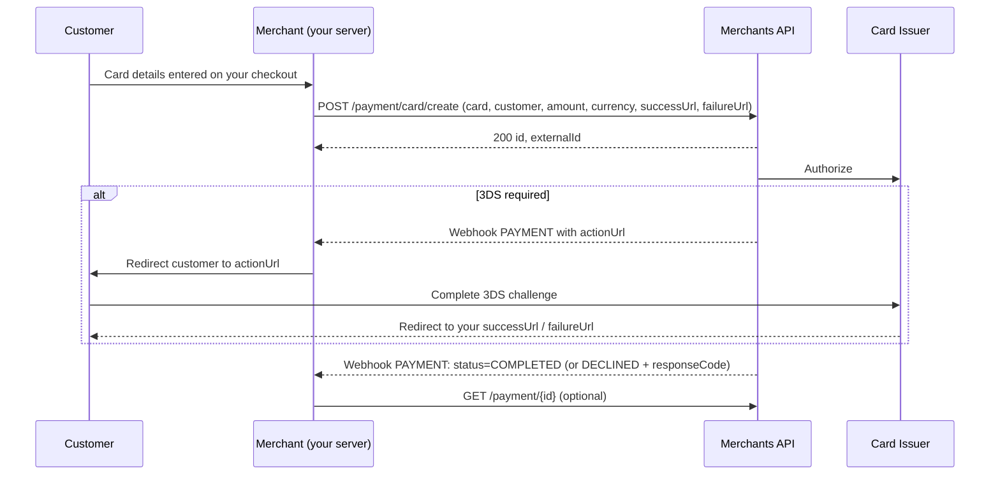
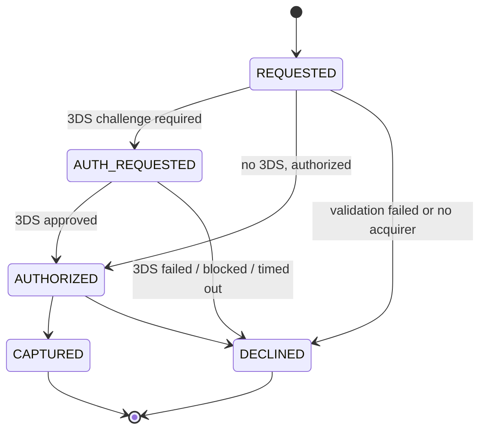
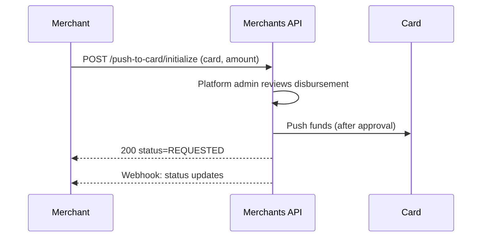
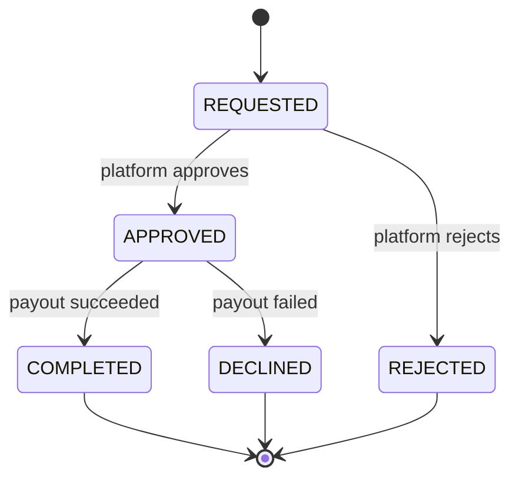

# Card Payments

Cards can be charged in various ways. Which of them are available to you depends on your engagement with the platform, your merchant account configuration and your PCI DSS scope — if unsure, ask the platform administrators before building:

|                       | Hosted Payments Page                                                                                              | Server-to-server                                                       |
|-----------------------|-------------------------------------------------------------------------------------------------------------------|------------------------------------------------------------------------|
| Endpoint              | [`POST /payment/crypto/initialize`](crypto-payments.md) / [`POST /payment/fiat/initialize`](fiat-payments.md)     | [`POST /payment/card/create`](#server-to-server-card-payment)          |
| Who collects the card | The platform, on the hosted page                                                                                  | You, on your own checkout                                              |
| PCI DSS               | Cardholder data never reaches your systems                                                                        | Your systems handle cardholder data — you must be certified for that scope |
| 3D Secure             | Handled on the hosted page                                                                                        | You redirect the customer to the `actionUrl` delivered by webhook      |
| Create response       | `actionUrl` to send the customer to                                                                               | `id` and `externalId` only — the outcome arrives by webhook            |

This page covers the server-to-server endpoint and the card-side mechanics shared by every card payment: the card attempt lifecycle, 3D Secure handling, push-to-card disbursements, and the sandbox test cards.

## Card Whitelisting Prerequisite

Depending on your merchant account configuration, cards may need to be [whitelisted](blocklist-and-whitelist.md#card-whitelist) before they can be used for payments. If your account has card whitelisting enabled, you must register each card via the whitelist API and wait for the ~72-hour cooldown period to expire before processing a payment. Payments attempted with non-whitelisted or cooldown-active cards will be declined. This applies to both the hosted page and `POST /payment/card/create`.

## Server-to-Server Card Payment

> **PCI DSS:** with this endpoint your systems collect and transmit cardholder data. It is enabled per merchant account and only for organisations that are PCI DSS certified for that scope — otherwise use the hosted payments page. Never log or persist the card number or CVC on your side.


```mermaid
sequenceDiagram
    participant C as Customer
    participant M as Merchant (your server)
    participant API as Merchants API
    participant I as Card Issuer

    C->>M: Card details entered on your checkout
    M->>API: POST /payment/card/create (card, customer, amount, currency, successUrl, failureUrl)
    API-->>M: 200 id, externalId
    API->>I: Authorize
    alt 3DS required
        API-->>M: Webhook PAYMENT with actionUrl
        M->>C: Redirect customer to actionUrl
        C->>I: Complete 3DS challenge
        I-->>C: Redirect to your successUrl / failureUrl
    end
    API-->>M: Webhook PAYMENT: status=COMPLETED (or DECLINED + responseCode)
    M->>API: GET /payment/{id} (optional)
```

The create call returns as soon as the payment is recorded. Authorization, 3D Secure and capture happen asynchronously and their result reaches you through the [`PAYMENT` webhook](webhooks.md) — configure it before going live, there is no synchronous outcome.

### Create a Card Payment

```bash
curl -X POST https://sandbox-merchants-api.nonprod.paygate.systems/payment/card/create \
  -H "Authorization: Bearer YOUR_ACCESS_TOKEN" \
  -H "Content-Type: application/json" \
  -d '{
    "externalId": "order-001",
    "customerEmail": "jane@example.com",
    "customerFirstName": "Jane",
    "customerLastName": "Doe",
    "currency": "EUR",
    "amount": 29.99,
    "card": {
      "number": "4111111111111111",
      "name": "Jane Smith",
      "expiry": { "month": 1, "year": 2035 },
      "cvc": "123"
    },
    "billingAddress": {
      "address1": "123 Main St",
      "city": "Berlin",
      "country": "DEU",
      "state": "BE",
      "zip": "10115"
    },
    "phone": "+49170123456",
    "customerIp": "80.10.1.2",
    "successUrl": "https://your-shop.com/checkout/success",
    "failureUrl": "https://your-shop.com/checkout/failure"
  }'
```

### Request Fields

| Field               | Type    | Required | Description                                                                                   |
|---------------------|---------|----------|-----------------------------------------------------------------------------------------------|
| `externalId`        | string  | Yes      | Your unique identifier ([details](idempotency.md)) — 1–255 characters, `A–Z a–z 0–9 _ -`     |
| `customerEmail`     | string  | Yes      | Customer email address                                                                        |
| `customerFirstName` | string  | Yes      | Customer first name                                                                           |
| `customerLastName`  | string  | Yes      | Customer last name                                                                            |
| `currency`          | string  | Yes      | ISO 4217 currency code — see [Supported Currencies](crypto-payments.md#supported-currencies)  |
| `amount`            | number  | Yes      | Amount to charge (minimum `0.01`, max 2 decimal places)                                       |
| `card.number`       | string  | Yes      | Full card number (12–19 digits)                                                               |
| `card.name`         | string  | Yes      | Cardholder name as printed on the card                                                        |
| `card.expiry.month` | integer | Yes      | Expiry month (1–12)                                                                           |
| `card.expiry.year`  | integer | Yes      | 4-digit expiry year; month and year together must not be in the past                          |
| `card.cvc`          | string  | Yes      | Card verification code (3–4 digits)                                                           |
| `billingAddress`    | object  | Yes      | Billing address (see below)                                                                   |
| `phone`             | string  | No       | Customer phone in E.164 format (e.g. `+49170123456`)                                          |
| `customerIp`        | string  | Yes      | Customer's IPv4 address — used for the customer location check                                |
| `successUrl`        | string  | Yes      | Where the customer lands after a successful 3D Secure challenge                               |
| `failureUrl`        | string  | Yes      | Where the customer lands after a failed 3D Secure challenge                                   |
| `metadata`          | string  | No       | Free-form metadata for your own reference                                                     |

`successUrl` and `failureUrl` are required even though they are only used when the issuer requires a 3DS challenge — without a challenge the customer never leaves your checkout. Requests are validated in full before anything is processed: a malformed field, an unsupported currency, or (in sandbox) a card that does not match a [test card](#testing) is rejected with `400`.

### Billing Address

| Field      | Type   | Required | Description                                  |
|------------|--------|----------|----------------------------------------------|
| `address1` | string | Yes      | Street address line 1                        |
| `address2` | string | No       | Street address line 2                        |
| `city`     | string | Yes      | City                                         |
| `country`  | string | Yes      | ISO 3166-1 alpha-3 country code (e.g. `DEU`) |
| `state`    | string | No       | ISO 3166-2 alpha-2 state/region code         |
| `zip`      | string | Yes      | Postal code                                  |

### Response

```json
{
  "id": "pay_550e8400-e29b-41d4-a716-446655440000",
  "externalId": "order-001"
}
```

| Field        | Type   | Description                     |
|--------------|--------|---------------------------------|
| `id`         | string | Platform-generated payment ID   |
| `externalId` | string | Your provided identifier        |

There is deliberately **no status and no 3DS URL in the response**: a `200` means the payment was recorded and processing has started. Everything after that — the 3DS redirect (if any), the decline reason, the capture — is delivered by the `PAYMENT` webhook, and can be read back at any time from [`GET /payment/{id}`](crypto-payments.md#payment-records-and-attempts).

### Status Codes

| Code | Meaning                                                                                                   |
|------|-----------------------------------------------------------------------------------------------------------|
| 200  | Payment recorded and processing started                                                                   |
| 400  | Invalid request (malformed field, unsupported currency, sandbox card not a [test card](#testing))          |
| 401  | Missing, invalid or expired access token                                                                  |
| 409  | Duplicate `externalId` (see [Idempotency](idempotency.md))                                                |
| 422  | Payment cannot be accepted (e.g. merchant account not active, or server-to-server card payments not enabled for your account) |

A decline is **not** an HTTP error: the request is accepted with `200` and the decline arrives later as a `PAYMENT` webhook with `status: DECLINED` and a `responseCode` (see [Error Handling](error-handling.md)).

### Handling 3D Secure

When the issuer requires a challenge, the card attempt moves to `AUTH_REQUESTED` and the platform sends a `PAYMENT` webhook whose payload carries an `actionUrl`:

```json
{
  "objectId": "pay_550e8400-e29b-41d4-a716-446655440000",
  "externalId": "order-001",
  "eventType": "PAYMENT",
  "status": "PENDING",
  "actionUrl": "https://sandbox-merchants-api.nonprod.paygate.systems/public/3ds/challenge/eyJhbGciOi...",
  "timestamp": "2026-09-28T10:05:00Z"
}
```

Redirect the customer's browser to the `actionUrl`. The platform takes the customer to the issuer's challenge and back, then redirects them to your `successUrl` or `failureUrl`; the terminal `PAYMENT` webhook (`COMPLETED`, or `DECLINED` with a [3DS `responseCode`](#id-3ds-failure-outcomes)) follows.

- `actionUrl` is present **only** in the notification sent while the attempt is `AUTH_REQUESTED`; key your handling off its presence, not off the status value.
- Treat the URL as opaque and single-use: it embeds a short-lived token bound to this payment. Do not parse, cache or reuse it.
- The `actionUrl` is never returned by the create call, so a webhook is a hard requirement for 3DS-capable integrations.

Payments that do not need a challenge skip this step entirely and go straight to the terminal notification.

## Card Attempt Lifecycle

However the card is charged — on the hosted payments page or via `POST /payment/card/create` — the card charge is recorded as an **attempt** inside the payment, visible in the `attempts` array of [`GET /payment/{id}`](crypto-payments.md#payment-records-and-attempts). The payment itself moves through the top-level [payment lifecycle](crypto-payments.md#payment-lifecycle) (`INITIALIZED → PENDING → COMPLETED / DECLINED`; a server-to-server card payment starts processing immediately, so it does not wait in `INITIALIZED` for the customer); each card attempt has its own sub-lifecycle:


```mermaid
stateDiagram-v2
    [*] --> REQUESTED
    REQUESTED --> AUTH_REQUESTED: 3DS challenge required
    REQUESTED --> AUTHORIZED: no 3DS, authorized
    REQUESTED --> DECLINED: validation failed or no acquirer
    AUTH_REQUESTED --> AUTHORIZED: 3DS approved
    AUTH_REQUESTED --> DECLINED: 3DS failed / blocked / timed out
    AUTHORIZED --> CAPTURED
    AUTHORIZED --> DECLINED
    CAPTURED --> [*]
    DECLINED --> [*]
```

| Status           | Description                                                                  |
|------------------|------------------------------------------------------------------------------|
| `REQUESTED`      | Card attempt created and being processed                                     |
| `AUTH_REQUESTED` | Customer must complete a 3DS challenge (set only when 3D Secure is required) |
| `AUTHORIZED`     | Card authorized, funds reserved                                              |
| `CAPTURED`       | Funds captured from the card (terminal, success)                             |
| `DECLINED`       | Attempt declined by the issuer or platform (terminal). For 3DS-specific declines, inspect `responseCode` (see [3DS failure outcomes](#id-3ds-failure-outcomes)). |

A captured attempt completes the payment (`status: COMPLETED`). On the hosted page a declined attempt can be followed by another attempt while the session is still valid; a declined server-to-server payment is final — create a new payment with a new `externalId` to retry. The [`PAYMENT` webhook](webhooks.md) reports the **payment-level** outcome (`COMPLETED` or `DECLINED`), not the individual attempt transitions (the one exception is the server-to-server [3DS notification](#handling-3d-secure)) — poll `GET /payment/{id}` if you need attempt-level detail.

## 3D Secure (3DS)

Where the challenge happens depends on how the card was charged:

- **Hosted payments page** — 3DS is handled entirely on the page: when the issuer requires a challenge, the page takes the customer through it and back, then continues the flow. You never deliver a 3DS URL yourself, and no webhook is sent for the challenge step.
- **Server-to-server** — you receive the challenge URL as `actionUrl` on a `PAYMENT` webhook and redirect the customer to it; see [Handling 3D Secure](#handling-3d-secure).

### 3DS failure outcomes

There is no dedicated status for 3DS failure or 3DS expiry. When a 3DS challenge does not succeed, the card attempt (and with it the payment) transitions to `DECLINED`, and the `responseCode` field carries the specific reason. Two `responseCode` values are 3DS-specific:

| `responseCode`     | When it is set                                                                                       |
|--------------------|------------------------------------------------------------------------------------------------------|
| `THREE_DS_FAILED`  | The 3DS challenge failed — authentication was unsuccessful, the issuer rejected the challenge, or the customer was blocked. |
| `THREE_DS_EXPIRED` | The 3DS challenge timed out — the customer did not complete authentication within the allowed time.    |

Both values arrive together with `status: DECLINED`, on the same `PAYMENT` webhook that signals the decline (and on `GET /payment/{id}`). To recognise a 3DS-related decline programmatically, check `status == DECLINED` **and** `responseCode in {THREE_DS_FAILED, THREE_DS_EXPIRED}`. The customer can usually retry with a new payment attempt.

## Push-to-Card


```mermaid
sequenceDiagram
    participant M as Merchant
    participant API as Merchants API
    participant C as Card

    M->>API: POST /push-to-card/initialize (card, amount)
    API->>API: Platform admin reviews disbursement
    API->>C: Push funds (after approval)
    API-->>M: 200 status=REQUESTED
    API-->>M: Webhook: status updates
```

Push funds directly to a customer's card. This is useful for disbursements, payouts, or refunds to a different card.

> **Note:** Push-to-card disbursements always require platform-administration review before funds are sent. The payment stays in `REQUESTED` until the platform approves or rejects it.

```bash
curl -X POST https://sandbox-merchants-api.nonprod.paygate.systems/push-to-card/initialize \
  -H "Authorization: Bearer YOUR_ACCESS_TOKEN" \
  -H "Content-Type: application/json" \
  -d '{
    "externalId": "payout-001",
    "currency": "EUR",
    "amount": 50.00,
    "card": {
      "number": "4111111111111111",
      "name": "Jane Doe",
      "expiry": { "month": 12, "year": 2027 }
    },
    "useRefunds": false
  }'
```

### Request Fields

| Field        | Type    | Required | Description                                              |
|--------------|---------|----------|----------------------------------------------------------|
| `externalId` | string  | Yes      | Your unique identifier                                   |
| `currency`   | string  | Yes      | ISO 4217 currency code                                   |
| `amount`     | number  | Yes      | Amount to push (minimum `0.01`)                          |
| `card`       | object  | Yes      | Recipient card details (`number`, `name`, `expiry` — no CVC) |
| `useRefunds` | boolean | Yes      | Must be `false` — see below                              |
| `metadata`   | string  | No       | Free-form metadata for your own reference                |

> **Note on `useRefunds`:** this flag is reserved for fulfilling the amount from available refund balances before pushing the remainder to the card. It is **not yet supported** — requests with `useRefunds: true` are rejected with `422 Unprocessable Entity`. Always send `false`.

### Response

```json
{
  "id": "ptc_xyz789",
  "externalId": "payout-001",
  "status": "REQUESTED"
}
```

### Get and List Disbursements

```bash
curl https://sandbox-merchants-api.nonprod.paygate.systems/push-to-card/payment/ptc_xyz789 \
  -H "Authorization: Bearer YOUR_ACCESS_TOKEN"

curl "https://sandbox-merchants-api.nonprod.paygate.systems/push-to-card/payment?limit=20" \
  -H "Authorization: Bearer YOUR_ACCESS_TOKEN"
```

The list endpoint supports the standard `limit`, `cursor`, and `externalId` query parameters. Each disbursement includes the masked card, amount, `status`, `responseCode` (decline reason, if any), and timestamps.

Status changes are delivered via webhooks with event type `PUSH_TO_CARD` (see [Webhooks](webhooks.md)) — disbursements do not share the payment event type.

### Push-to-Card Lifecycle

Push-to-card disbursements use a different state machine from card payments. They never go through 3D Secure, so `AUTH_REQUESTED`, `AUTHORIZED`, and `CAPTURED` do not apply.


```mermaid
stateDiagram-v2
    [*] --> REQUESTED
    REQUESTED --> APPROVED: platform approves
    REQUESTED --> REJECTED: platform rejects
    APPROVED --> COMPLETED: payout succeeded
    APPROVED --> DECLINED: payout failed
    COMPLETED --> [*]
    DECLINED --> [*]
    REJECTED --> [*]
```

| Status      | Description                                                  |
|-------------|--------------------------------------------------------------|
| `REQUESTED` | Disbursement created, awaiting platform-administration review |
| `APPROVED`  | Approved by platform admin, sent to the payout processor     |
| `REJECTED`  | Rejected by platform admin during review (terminal)          |
| `COMPLETED` | Funds successfully pushed to the card (terminal, success)    |
| `DECLINED`  | Payout failed at the processor (terminal)                    |

## Testing

> **Warning:** Only **synthetic (fictitious) data** may be used in the sandbox environment. The use of real personally identifiable information (PII) or real cardholder data (CHD) is **strictly forbidden**.

Use the following test cards in the **sandbox** environment — on the hosted payments page or in `POST /payment/card/create` — to simulate different payment outcomes.

### How test cards work

Each row in the tables below represents a single test scenario with a deterministic outcome. To trigger that outcome, you must submit the payment using **all three fields exactly as shown**: card number, expiry date, and cardholder name. If any field does not match, the submission is rejected with `400 Bad Request: "card is not valid for test payments"` before any payment processing occurs (on the hosted page this is shown to the customer; on `POST /payment/card/create` it is the HTTP response).

- Cardholder name matching is **case-insensitive** — `"jane smith"` and `"JANE SMITH"` both match `Jane Smith`.
- The CVC field accepts any 3-digit value (e.g. `123`).
- Use reachable `successUrl` and `failureUrl` values when testing so you can observe the redirect behaviour.
- Use a unique `externalId` for each test payment to avoid `409 Conflict` errors.

### Visa — Approved

| Card Number          | Expiry    | Cardholder        | Notes                 |
|----------------------|-----------|-------------------|-----------------------|
| `4462030000000000`   | `01/2035` | `John Smith`      |                          |
| `4111111111111111`   | `01/2035` | `Jane Smith`      |                          |

### Visa — Declined

| Card Number          | Expiry    | Cardholder   | Reason             |
|----------------------|-----------|--------------|--------------------|
| `4111111111111105`   | `01/2035` | `Jane Smith` | Do not honor       |
| `4111111111111143`   | `01/2035` | `Jane Smith` | Stolen card        |
| `4111111111111151`   | `01/2035` | `Jane Smith` | Insufficient funds |
