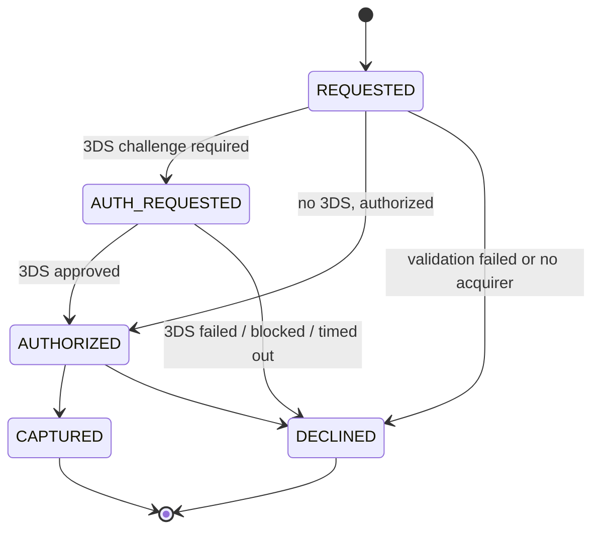

# Card Payments

Cards can be charged in various ways. Which of them are available to you depends on your engagement with the platform, your merchant account configuration and your PCI DSS scope — if unsure, ask the platform administrators before building:

|                       | Hosted Payments Page                                                                                              | Server-to-server                                                       |
|-----------------------|-------------------------------------------------------------------------------------------------------------------|------------------------------------------------------------------------|
| Endpoint              | [`POST /payment/crypto/initialize`](crypto-payments.md) / [`POST /payment/fiat/initialize`](fiat-payments.md)     | [`POST /payment/card/create`](server-to-server-card-payments.md)          |
| Who collects the card | The platform, on the hosted page                                                                                  | You, on your own checkout                                              |
| PCI DSS               | Cardholder data never reaches your systems                                                                        | Your systems handle cardholder data — you must be certified for that scope |
| 3D Secure             | Handled on the hosted page                                                                                        | You redirect the customer to the `actionUrl` delivered by webhook      |
| Create response       | `actionUrl` to send the customer to                                                                               | `id` and `externalId` only — the outcome arrives by webhook            |

Each integration path has its own page ([Crypto Payments](crypto-payments.md), [Fiat Payments](fiat-payments.md), [Server-to-Server Card Payments](server-to-server-card-payments.md)). This page covers the card-side mechanics shared by all of them: the card attempt lifecycle, 3D Secure handling, and the sandbox test cards. Disbursements to cards are described under [Push-to-Card](push-to-card.md).

## Card Whitelisting Prerequisite

Depending on your merchant account configuration, cards may need to be [whitelisted](blocklist-and-whitelist.md#card-whitelist) before they can be used for payments. If your account has card whitelisting enabled, you must register each card via the whitelist API and wait for the ~72-hour cooldown period to expire before processing a payment. Payments attempted with non-whitelisted or cooldown-active cards will be declined. This applies to both the hosted page and `POST /payment/card/create`.

## Card Attempt Lifecycle

However the card is charged — on the hosted payments page or via `POST /payment/card/create` — the card charge is recorded as an **attempt** inside the payment, visible in the `attempts` array of [`GET /payment/{id}`](crypto-payments.md#payment-records-and-attempts). The payment itself moves through the top-level [payment lifecycle](crypto-payments.md#payment-lifecycle) (`INITIALIZED → PENDING → COMPLETED / DECLINED`; a server-to-server card payment is created already `PENDING` — see its [status progression](server-to-server-card-payments.md#status-progression)); each card attempt has its own sub-lifecycle:

```mermaid
stateDiagram-v2
    [*] --> REQUESTED
    REQUESTED --> AUTH_REQUESTED: 3DS challenge required
    REQUESTED --> AUTHORIZED: no 3DS, authorized
    REQUESTED --> DECLINED: validation failed or no acquirer
    AUTH_REQUESTED --> AUTHORIZED: 3DS approved
    AUTH_REQUESTED --> DECLINED: 3DS failed / blocked / timed out
    AUTHORIZED --> CAPTURED
    AUTHORIZED --> DECLINED
    CAPTURED --> [*]
    DECLINED --> [*]
```

| Status           | Description                                                                  |
|------------------|------------------------------------------------------------------------------|
| `REQUESTED`      | Card attempt created and being processed                                     |
| `AUTH_REQUESTED` | Customer must complete a 3DS challenge (set only when 3D Secure is required) |
| `AUTHORIZED`     | Card authorized, funds reserved                                              |
| `CAPTURED`       | Funds captured from the card (terminal, success)                             |
| `DECLINED`       | Attempt declined by the issuer or platform (terminal). For 3DS-specific declines, inspect `responseCode` (see [3DS failure outcomes](#id-3ds-failure-outcomes)). |

A captured attempt completes the payment (`status: COMPLETED`). On the hosted page a declined attempt can be followed by another attempt while the session is still valid; a declined server-to-server payment is final — create a new payment with a new `externalId` to retry. The [`PAYMENT` webhook](webhooks.md) reports the **payment-level** outcome (`COMPLETED` or `DECLINED`), not the individual attempt transitions (the one exception is the server-to-server `AUTH_REQUESTED` [3DS notification](server-to-server-card-payments.md#handling-3d-secure)) — poll `GET /payment/{id}` if you need attempt-level detail.

## 3D Secure (3DS)

Where the challenge happens depends on how the card was charged:

- **Hosted payments page** — 3DS is handled entirely on the page: when the issuer requires a challenge, the page takes the customer through it and back, then continues the flow. You never deliver a 3DS URL yourself, and no webhook is sent for the challenge step.
- **Server-to-server** — you receive the challenge URL as `actionUrl` on a `PAYMENT` webhook and redirect the customer to it; see [Handling 3D Secure](server-to-server-card-payments.md#handling-3d-secure).

### 3DS failure outcomes

There is no dedicated status for 3DS failure or 3DS expiry. When a 3DS challenge does not succeed, the card attempt (and with it the payment) transitions to `DECLINED`, and the `responseCode` field carries the specific reason. Two `responseCode` values are 3DS-specific:

| `responseCode`     | When it is set                                                                                       |
|--------------------|------------------------------------------------------------------------------------------------------|
| `THREE_DS_FAILED`  | The 3DS challenge failed — authentication was unsuccessful, the issuer rejected the challenge, or the customer was blocked. |
| `THREE_DS_EXPIRED` | The 3DS challenge timed out — the customer did not complete authentication within the allowed time.    |

Both values arrive together with `status: DECLINED`, on the same `PAYMENT` webhook that signals the decline (and on `GET /payment/{id}`). To recognise a 3DS-related decline programmatically, check `status == DECLINED` **and** `responseCode in {THREE_DS_FAILED, THREE_DS_EXPIRED}`. The customer can usually retry with a new payment attempt.

## Testing

> **Warning:** Only **synthetic (fictitious) data** may be used in the sandbox environment. The use of real personally identifiable information (PII) or real cardholder data (CHD) is **strictly forbidden**.

Use the following test cards in the **sandbox** environment — on the hosted payments page or in `POST /payment/card/create` — to simulate different payment outcomes.

### How test cards work

Each row in the tables below represents a single test scenario with a deterministic outcome. To trigger that outcome, you must submit the payment using **all three fields exactly as shown**: card number, expiry date, and cardholder name. If any field does not match, the submission is rejected with `400 Bad Request: "card is not valid for test payments"` before any payment processing occurs (on the hosted page this is shown to the customer; on `POST /payment/card/create` it is the HTTP response).

- Cardholder name matching is **case-insensitive** — `"jane smith"` and `"JANE SMITH"` both match `Jane Smith`.
- The CVC field accepts any 3-digit value (e.g. `123`).
- Use reachable `successUrl` and `failureUrl` values when testing so you can observe the redirect behaviour.
- Use a unique `externalId` for each test payment to avoid `409 Conflict` errors.

### Visa — Approved

| Card Number          | Expiry    | Cardholder        | Notes                 |
|----------------------|-----------|-------------------|-----------------------|
| `4462030000000000`   | `01/2035` | `John Smith`      |                          |
| `4111111111111111`   | `01/2035` | `Jane Smith`      |                          |

### Visa — Declined

| Card Number          | Expiry    | Cardholder   | Reason             |
|----------------------|-----------|--------------|--------------------|
| `4111111111111105`   | `01/2035` | `Jane Smith` | Do not honor       |
| `4111111111111143`   | `01/2035` | `Jane Smith` | Stolen card        |
| `4111111111111151`   | `01/2035` | `Jane Smith` | Insufficient funds |
