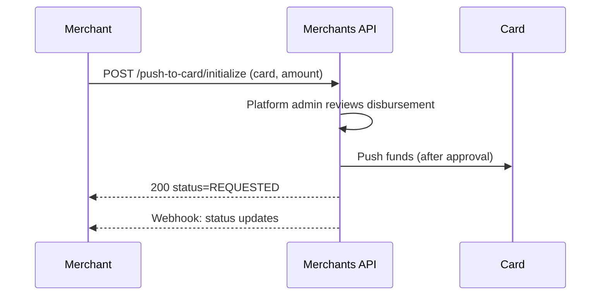
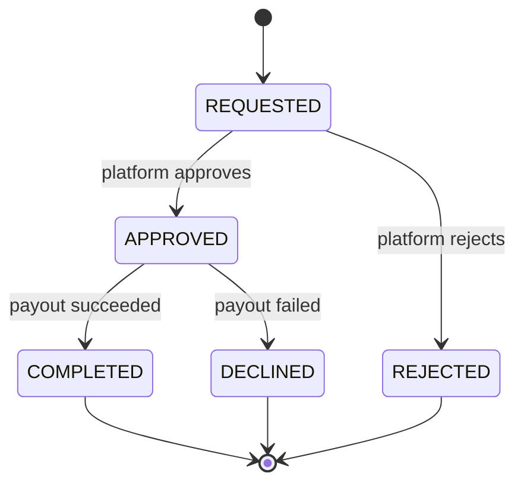

# Push-to-Card




Push funds directly to a customer's card. This is useful for disbursements, payouts, or refunds to a different card.

> **Note:** Push-to-card disbursements always require platform-administration review before funds are sent. The payment stays in `REQUESTED` until the platform approves or rejects it.

```bash
curl -X POST https://sandbox-merchants-api.nonprod.paygate.systems/push-to-card/initialize \
  -H "Authorization: Bearer YOUR_ACCESS_TOKEN" \
  -H "Content-Type: application/json" \
  -d '{
    "externalId": "payout-001",
    "currency": "EUR",
    "amount": 50.00,
    "card": {
      "number": "4111111111111111",
      "name": "Jane Doe",
      "expiry": { "month": 12, "year": 2027 }
    },
    "useRefunds": false
  }'
```

## Request Fields

| Field        | Type    | Required | Description                                              |
|--------------|---------|----------|----------------------------------------------------------|
| `externalId` | string  | Yes      | Your unique identifier                                   |
| `currency`   | string  | Yes      | ISO 4217 currency code                                   |
| `amount`     | number  | Yes      | Amount to push (minimum `0.01`)                          |
| `card`       | object  | Yes      | Recipient card details (`number`, `name`, `expiry` — no CVC) |
| `useRefunds` | boolean | Yes      | Must be `false` — see below                              |
| `metadata`   | string  | No       | Free-form metadata for your own reference                |

> **Note on `useRefunds`:** this flag is reserved for fulfilling the amount from available refund balances before pushing the remainder to the card. It is **not yet supported** — requests with `useRefunds: true` are rejected with `422 Unprocessable Entity`. Always send `false`.

## Response

```json
{
  "id": "ptc_xyz789",
  "externalId": "payout-001",
  "status": "REQUESTED"
}
```

## Get and List Disbursements

```bash
curl https://sandbox-merchants-api.nonprod.paygate.systems/push-to-card/payment/ptc_xyz789 \
  -H "Authorization: Bearer YOUR_ACCESS_TOKEN"

curl "https://sandbox-merchants-api.nonprod.paygate.systems/push-to-card/payment?limit=20" \
  -H "Authorization: Bearer YOUR_ACCESS_TOKEN"
```

The list endpoint supports the standard `limit`, `cursor`, and `externalId` query parameters. Each disbursement includes the masked card, amount, `status`, `responseCode` (decline reason, if any), and timestamps.

Status changes are delivered via webhooks with event type `PUSH_TO_CARD` (see [Webhooks](webhooks.md)) — disbursements do not share the payment event type.

## Push-to-Card Lifecycle

Push-to-card disbursements use a different state machine from card payments. They never go through 3D Secure, so `AUTH_REQUESTED`, `AUTHORIZED`, and `CAPTURED` do not apply.



| Status      | Description                                                  |
|-------------|--------------------------------------------------------------|
| `REQUESTED` | Disbursement created, awaiting platform-administration review |
| `APPROVED`  | Approved by platform admin, sent to the payout processor     |
| `REJECTED`  | Rejected by platform admin during review (terminal)          |
| `COMPLETED` | Funds successfully pushed to the card (terminal, success)    |
| `DECLINED`  | Payout failed at the processor (terminal)                    |
