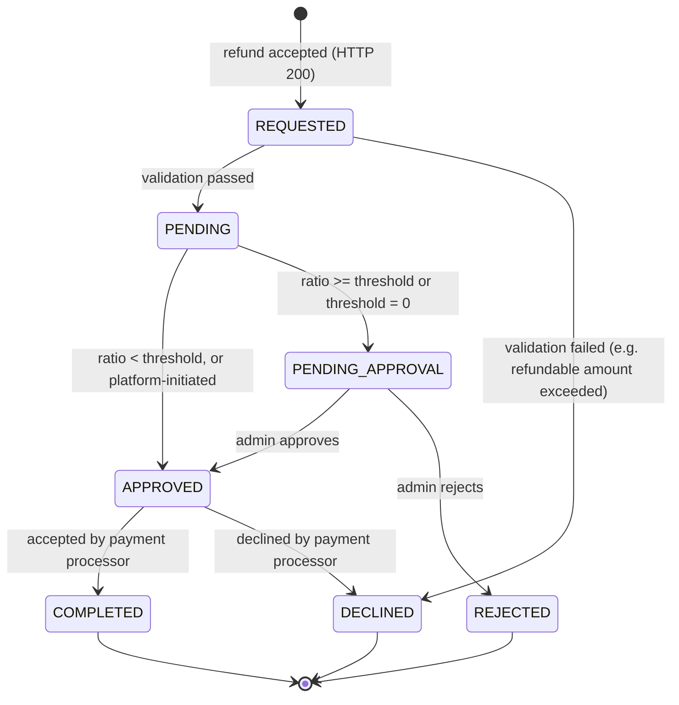

# Refunds and Chargebacks

You can refund a completed payment either fully or partially with [`POST /payment/{id}/refund/initialize`](#create-a-refund), using the original payment's platform-generated `id`. Chargebacks raised by the customer's bank are recorded against your payments and surfaced the same way as refunds — see [Chargebacks](#chargebacks) below.

> **Removed endpoint (2026-09):** the legacy `POST /payment/{id}/refund` no longer exists — it applied only to payments created through the removed direct card endpoints. All refunds go through `POST /payment/{id}/refund/initialize`.

## Create a Refund

```bash
curl -X POST https://sandbox-merchants-api.nonprod.paygate.systems/payment/pay_abc123/refund/initialize \
  -H "Authorization: Bearer YOUR_ACCESS_TOKEN" \
  -H "Content-Type: application/json" \
  -d '{
    "externalId": "refund-order-001",
    "amount": 10.00
  }'
```

### Request Fields

| Field        | Type   | Required | Description                                              |
|--------------|--------|----------|----------------------------------------------------------|
| `externalId` | string | Yes      | Your unique identifier for this refund ([details](idempotency.md)) |
| `amount`     | number | No       | Amount to refund (minimum `0.01`). Omit for a full refund. |

### Full vs. Partial Refund

- **Full refund** — omit the `amount` field. The entire payment amount is refunded.
- **Partial refund** — provide an `amount` less than or equal to the original payment amount.

> **Note:** Partial refunds are not always available. Depending on the payment processing path, some payments only support full refunds. If you request a partial refund on a payment that does not support it, the API returns an error. When this happens, you can request a full refund instead.

### Response

Refunds are processed **asynchronously**. A successful request returns **200 OK** with the refund in `REQUESTED` status — the refund record is created immediately and then validated and processed in the background. The final outcome is delivered via [webhook](#webhook-notifications) and can also be polled via `GET /payment/{id}`.

```json
{
  "id": "ref_def456",
  "paymentId": "pay_abc123",
  "amount": 10.00,
  "status": "REQUESTED"
}
```

For a full refund (request without `amount`), the response `amount` is the full amount of the original payment.

### Response Fields

| Field       | Type   | Description                              |
|-------------|--------|------------------------------------------|
| `id`        | string | Platform-generated refund ID             |
| `paymentId` | string | ID of the original payment               |
| `amount`    | number | Refund amount                            |
| `status`    | string | Refund status                            |

### Status Codes

| Code | Meaning                                                            |
|------|--------------------------------------------------------------------|
| 200  | Refund accepted and submitted for processing (`status: REQUESTED`) |
| 400  | Invalid request (e.g. non-positive or malformed `amount`)          |
| 404  | Payment not found                                                  |
| 409  | Duplicate `externalId` (see [Idempotency](idempotency.md))         |
| 422  | Partial refund not supported for this payment, or refunds not enabled for your merchant account |

> **Note:** Whether the requested amount exceeds the remaining refundable amount is verified **asynchronously** during processing, not at submission. If the check fails, the refund transitions to `DECLINED` (see the [lifecycle](#refund-lifecycle) below) — you are notified via webhook rather than an HTTP error.

## Checking Refund Status

Refunds are payments of type `REFUND`. Use the refund `id` with the payment endpoint:

```bash
curl https://sandbox-merchants-api.nonprod.paygate.systems/payment/ref_def456 \
  -H "Authorization: Bearer YOUR_ACCESS_TOKEN"
```

The response includes a `parentPaymentId` field linking the refund back to the original payment, `type: REFUND`, and a `details` object carrying the refund's own status, amount, masked card, `responseCode`, and timestamps. The original payment's `amountRefunded` field accumulates the refunded total.

## Refund Lifecycle

A refund follows its own state machine, separate from the [card attempt lifecycle](card-payments.md#card-attempt-lifecycle). Statuses such as `AUTH_REQUESTED`, `AUTHORIZED`, and `CAPTURED` never appear on a refund.



| Status             | Description                                                                                  |
|--------------------|----------------------------------------------------------------------------------------------|
| `REQUESTED`        | Refund created and queued for validation                                                      |
| `PENDING`          | Validation passed (refundable amount verified) — being evaluated against the merchant's refund-ratio threshold |
| `PENDING_APPROVAL` | At or above the threshold (or threshold disabled) — awaiting manual review by platform administration |
| `APPROVED`         | Approved (auto or by admin), refund is being sent to the payment processor                    |
| `COMPLETED`        | Refund successfully processed by the payment processor (terminal)                             |
| `REJECTED`         | Refund rejected during manual review by platform administration (terminal)                    |
| `DECLINED`         | Refund failed validation (e.g. refundable amount exceeded, payment not refundable) or was declined by the payment processor (terminal) |

> **Note on `PENDING_APPROVAL`:** No action is required from the merchant — the platform-administration team will process the approval.

> **Note on platform-initiated refunds:** Refunds initiated directly by platform administration bypass the threshold evaluation and move straight from `PENDING` to `APPROVED`.

## Webhook Notifications

A `REFUND` webhook **is sent when a refund reaches a terminal status** — `COMPLETED`, `DECLINED`, or `REJECTED`. Intermediate statuses (`REQUESTED`, `PENDING`, `PENDING_APPROVAL`, `APPROVED`) do **not** trigger webhook notifications; poll the refund if you need to observe them. (Refund notifications used to arrive on the `CARD_PAYMENT` event type — see the [event-type restructuring note](webhooks.md).)

The webhook payload identifies the refund by its `id` (as `objectId`) and your `externalId`:

```json
{
  "eventType": "REFUND",
  "objectId": "ref_def456",
  "externalId": "refund-order-001",
  "status": "COMPLETED",
  "timestamp": "2026-03-04T12:00:00Z"
}
```

For `DECLINED` refunds, the `responseCode` field carries the decline reason. See [Webhooks](webhooks.md) for configuration and delivery details.

> **Note on duplicate `externalId`:** a duplicate is always rejected synchronously with `409 Conflict` — no refund record is created and no webhook is sent. See [Idempotency](idempotency.md) for guidance on choosing `externalId` values.

## Chargebacks

A chargeback is initiated by the customer's bank, not by you — there is no endpoint to create one. When the acquirer reports a chargeback against one of your payments, the platform records it as a payment of **type `CHARGEBACK`**:

- Read it back with `GET /payment/{id}` (or find it via `GET /payment`). Like a refund, it carries a `parentPaymentId` linking to the original payment and a `details` object with the chargeback's own status, amount, masked card, `responseCode`, and timestamps.
- The original payment's `amountRefunded` field accumulates charged-back amounts together with refunds.
- A chargeback starts in `REQUESTED` and ends in `COMPLETED` (funds returned to the customer) or `DECLINED` (the chargeback was invalid — for example, it exceeded the remaining refundable amount). The manual-approval statuses of the refund lifecycle do not apply.

### Chargeback webhook

Configure a webhook with event type `CHARGEBACK` (see [Webhooks](webhooks.md)) to be notified when a chargeback is processed. The notification is sent when the chargeback **completes**; the payload follows the standard shape, with `objectId` set to the chargeback's ID:

```json
{
  "eventType": "CHARGEBACK",
  "objectId": "chb_a1b2c3d4-e5f6-7890-abcd-ef1234567890",
  "externalId": "order-001",
  "status": "COMPLETED",
  "timestamp": "2026-09-04T12:00:00Z"
}
```

No action is required from you — the webhook is informational, so you can reconcile the charged-back amount in your own systems.

## Best Practices

- **Use a unique `externalId` per refund** to ensure idempotency. If you retry a refund request with the same `externalId`, you'll receive a `409 Conflict` rather than a duplicate refund.
- **Check the original payment status** before requesting a refund. Refunds can only be issued against successfully captured payments.
- **Track partial refunds carefully.** The total of all partial refunds must not exceed the original payment amount.
