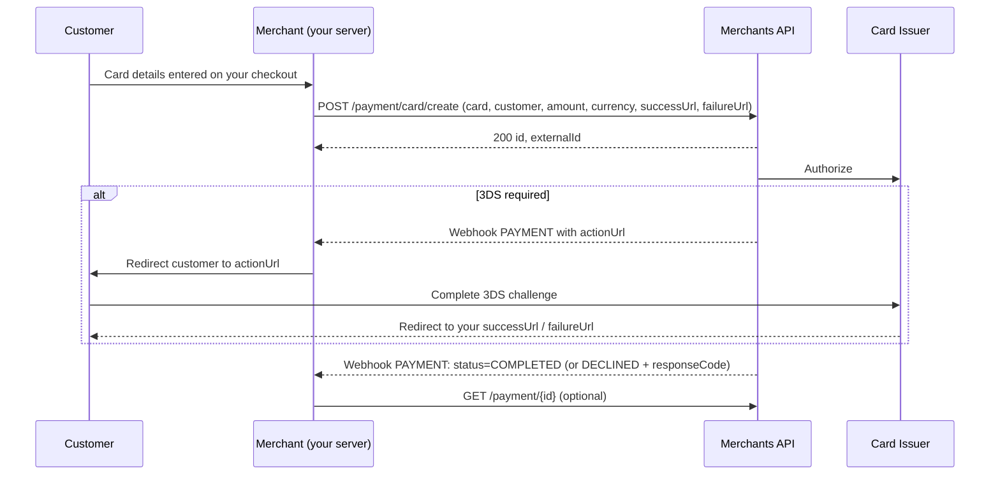

# Server-to-Server Card Payments

Server-to-server card payments let you collect card details on your own checkout and submit them directly to the Merchants API with `POST /payment/card/create` — there is no hosted page. The card charge itself is recorded as a card attempt inside the payment, so the [card attempt lifecycle](card-payments.md#card-attempt-lifecycle), the [3DS decline codes](card-payments.md#id-3ds-failure-outcomes) and the [test cards](card-payments.md#testing) described on the [Card Payments](card-payments.md) page apply unchanged. Cards must be [whitelisted](blocklist-and-whitelist.md#card-whitelist) before they can be used, as for the hosted page.

> **PCI DSS:** with this endpoint your systems collect and transmit cardholder data. It is enabled per merchant account and only for organisations that are PCI DSS certified for that scope — otherwise use the hosted payments page. Never log or persist the card number or CVC on your side.



The create call returns as soon as the payment is recorded. Authorization, 3D Secure and capture happen asynchronously and their result reaches you through the [`PAYMENT` webhook](webhooks.md) — configure it before going live, there is no synchronous outcome.

## Create a Card Payment

```bash
curl -X POST https://sandbox-merchants-api.nonprod.paygate.systems/payment/card/create \
  -H "Authorization: Bearer YOUR_ACCESS_TOKEN" \
  -H "Content-Type: application/json" \
  -d '{
    "externalId": "order-001",
    "customerEmail": "jane@example.com",
    "customerFirstName": "Jane",
    "customerLastName": "Doe",
    "currency": "EUR",
    "amount": 29.99,
    "card": {
      "number": "4111111111111111",
      "name": "Jane Smith",
      "expiry": { "month": 1, "year": 2035 },
      "cvc": "123"
    },
    "billingAddress": {
      "address1": "123 Main St",
      "city": "Berlin",
      "country": "DEU",
      "state": "BE",
      "zip": "10115"
    },
    "phone": "+49170123456",
    "customerIp": "80.10.1.2",
    "successUrl": "https://your-shop.com/checkout/success",
    "failureUrl": "https://your-shop.com/checkout/failure"
  }'
```

## Request Fields

| Field               | Type    | Required | Description                                                                                   |
|---------------------|---------|----------|-----------------------------------------------------------------------------------------------|
| `externalId`        | string  | Yes      | Your unique identifier ([details](idempotency.md)) — 1–255 characters, `A–Z a–z 0–9 _ -`     |
| `customerEmail`     | string  | Yes      | Customer email address                                                                        |
| `customerFirstName` | string  | Yes      | Customer first name                                                                           |
| `customerLastName`  | string  | Yes      | Customer last name                                                                            |
| `currency`          | string  | Yes      | ISO 4217 currency code — see [Supported Currencies](crypto-payments.md#supported-currencies)  |
| `amount`            | number  | Yes      | Amount to charge (minimum `0.01`, max 2 decimal places)                                       |
| `card.number`       | string  | Yes      | Full card number (12–19 digits)                                                               |
| `card.name`         | string  | Yes      | Cardholder name as printed on the card                                                        |
| `card.expiry.month` | integer | Yes      | Expiry month (1–12)                                                                           |
| `card.expiry.year`  | integer | Yes      | 4-digit expiry year; month and year together must not be in the past                          |
| `card.cvc`          | string  | Yes      | Card verification code (3–4 digits)                                                           |
| `billingAddress`    | object  | Yes      | Billing address (see below)                                                                   |
| `phone`             | string  | No       | Customer phone in E.164 format (e.g. `+49170123456`)                                          |
| `customerIp`        | string  | Yes      | Customer's IPv4 address — used for the customer location check                                |
| `successUrl`        | string  | Yes      | Where the customer lands after a successful 3D Secure challenge                               |
| `failureUrl`        | string  | Yes      | Where the customer lands after a failed 3D Secure challenge                                   |
| `metadata`          | string  | No       | Free-form metadata for your own reference                                                     |

`successUrl` and `failureUrl` are required even though they are only used when the issuer requires a 3DS challenge — without a challenge the customer never leaves your checkout. Requests are validated in full before anything is processed: a malformed field, an unsupported currency, or (in sandbox) a card that does not match a [test card](card-payments.md#testing) is rejected with `400`.

## Billing Address

| Field      | Type   | Required | Description                                  |
|------------|--------|----------|----------------------------------------------|
| `address1` | string | Yes      | Street address line 1                        |
| `address2` | string | No       | Street address line 2                        |
| `city`     | string | Yes      | City                                         |
| `country`  | string | Yes      | ISO 3166-1 alpha-3 country code (e.g. `DEU`) |
| `state`    | string | No       | ISO 3166-2 alpha-2 state/region code         |
| `zip`      | string | Yes      | Postal code                                  |

## Response

```json
{
  "id": "pay_550e8400-e29b-41d4-a716-446655440000",
  "externalId": "order-001"
}
```

| Field        | Type   | Description                     |
|--------------|--------|---------------------------------|
| `id`         | string | Platform-generated payment ID   |
| `externalId` | string | Your provided identifier        |

There is deliberately **no status and no 3DS URL in the response**: a `200` means the payment was recorded and processing has started. Everything after that — the 3DS redirect (if any), the decline reason, the capture — is delivered by the `PAYMENT` webhook, and can be read back at any time from [`GET /payment/{id}`](crypto-payments.md#payment-records-and-attempts).

## Status Codes

| Code | Meaning                                                                                                   |
|------|-----------------------------------------------------------------------------------------------------------|
| 200  | Payment recorded and processing started                                                                   |
| 400  | Invalid request (malformed field, unsupported currency, sandbox card not a [test card](card-payments.md#testing))          |
| 401  | Missing, invalid or expired access token                                                                  |
| 409  | Duplicate `externalId` (see [Idempotency](idempotency.md))                                                |
| 422  | Payment cannot be accepted (e.g. merchant account not active, or server-to-server card payments not enabled for your account) |

A decline is **not** an HTTP error: the request is accepted with `200` and the decline arrives later as a `PAYMENT` webhook with `status: DECLINED` and a `responseCode` (see [Error Handling](error-handling.md)).

## Handling 3D Secure

When the issuer requires a challenge, the card attempt moves to `AUTH_REQUESTED` and the platform sends a `PAYMENT` webhook whose payload carries an `actionUrl`:

```json
{
  "objectId": "pay_550e8400-e29b-41d4-a716-446655440000",
  "externalId": "order-001",
  "eventType": "PAYMENT",
  "status": "PENDING",
  "actionUrl": "https://sandbox-merchants-api.nonprod.paygate.systems/public/3ds/challenge/eyJhbGciOi...",
  "timestamp": "2026-09-28T10:05:00Z"
}
```

Redirect the customer's browser to the `actionUrl`. The platform takes the customer to the issuer's challenge and back, then redirects them to your `successUrl` or `failureUrl`; the terminal `PAYMENT` webhook (`COMPLETED`, or `DECLINED` with a [3DS `responseCode`](card-payments.md#id-3ds-failure-outcomes)) follows.

- `actionUrl` is present **only** in the notification sent while the attempt is `AUTH_REQUESTED`; key your handling off its presence, not off the status value.
- Treat the URL as opaque and single-use: it embeds a short-lived token bound to this payment. Do not parse, cache or reuse it.
- The `actionUrl` is never returned by the create call, so a webhook is a hard requirement for 3DS-capable integrations.

Payments that do not need a challenge skip this step entirely and go straight to the terminal notification.

## Testing

Use the sandbox [test cards](card-payments.md#testing) — card number, expiry and cardholder name must match a listed row exactly, or the request is rejected with `400`. Only synthetic data may be used in sandbox.
